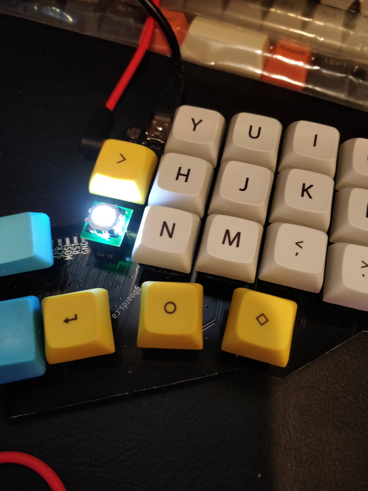

# Gergo Build Images

A completed unit.

5x10k, 2x22, 2x2.2k

5x0.1uF, 2x22pF, 1x1uF and oscilator

Reset!

Tinning a diode pad

Sliding the diode in

Finishing the other side

Mislabeled Silk, C6 is 0.1uF, R1 is 2.2k

Another silk mistake, C5 is 0.1uF

22 = 22R0

103 = 10K

222 = 2.2K

A Properly connected Cap

Notice the angle on the capacitor joint. It is solid.

Showing the orientation of the MCU. Notice that the oscilator has 2 connected pads

Close up of the osc traces, notice the connection

Oscilator whacked in properly

TRRS/USB solder, notice the amount on the TRRS, you want as much as possible on there!

Proper placement

Position of the circle on the silks for the IO

Flux gunk before and after cleaning with alcohol

A beautiful MCU job. Notice the spaces.

Trackball PCB so you don't need to squint

# There's a few more in the img/ take a look!
=======

