# Gergo Build Images

A completed unit.

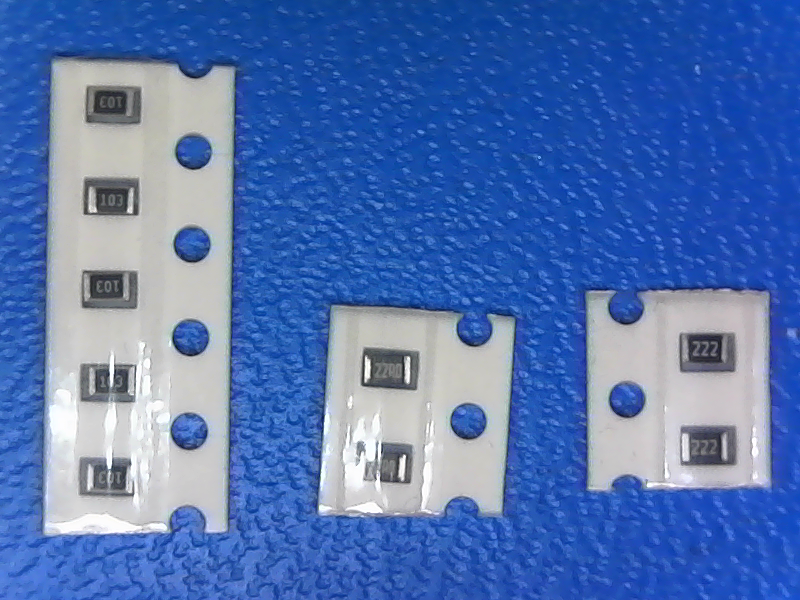

5x10k, 2x22, 2x2.2k

5x0.1uF, 2x22pF, 1x1uF and oscilator

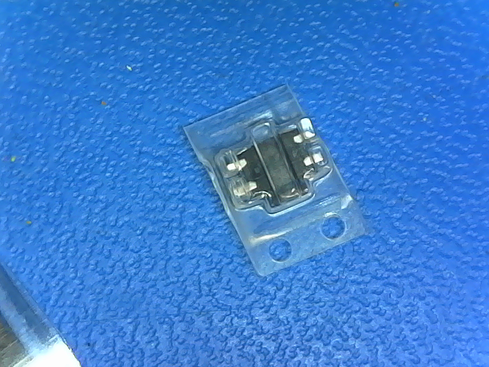

Reset!

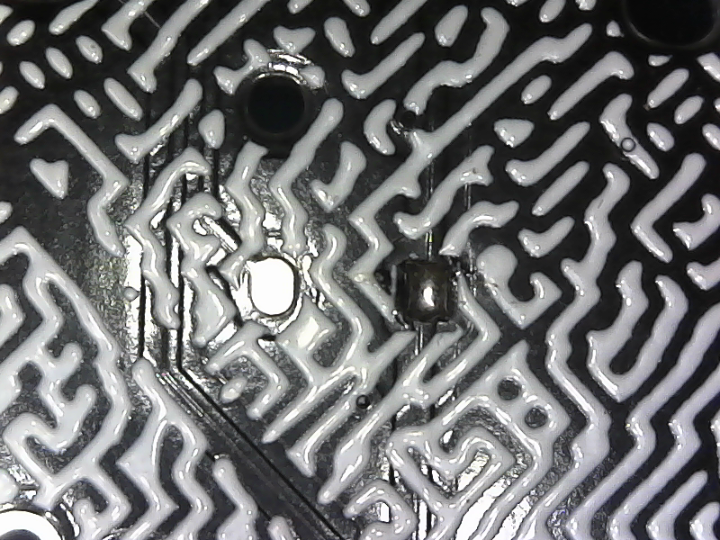

Tinning a diode pad

Sliding the diode in

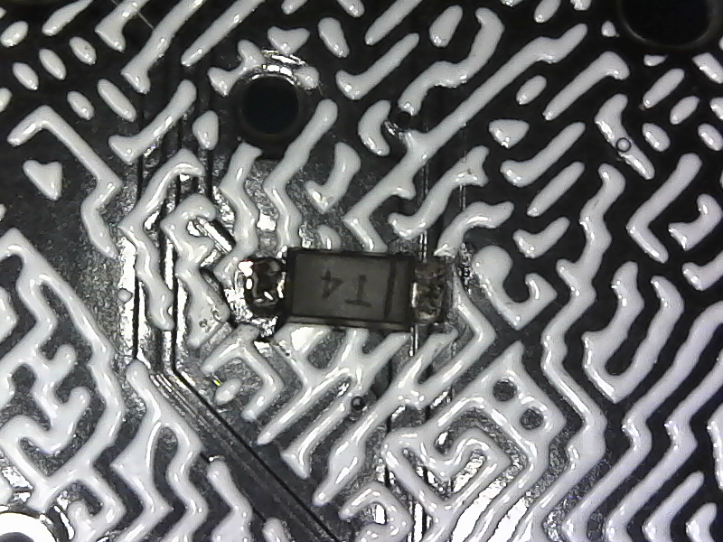

Finishing the other side

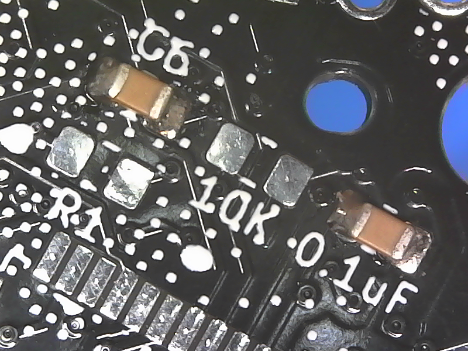

Mislabeled Silk, C6 is 0.1uF, R1 is 2.2k

Another silk mistake, C5 is 0.1uF

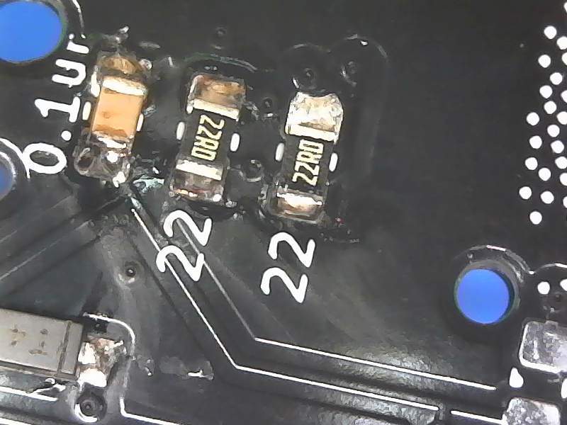

22 = 22R0

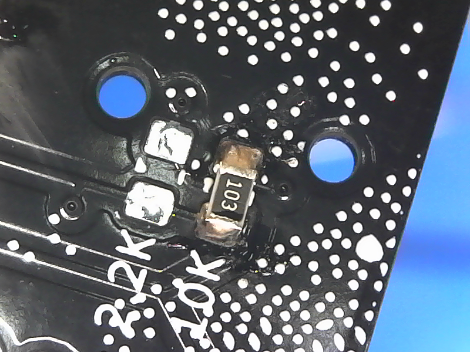

103 = 10K

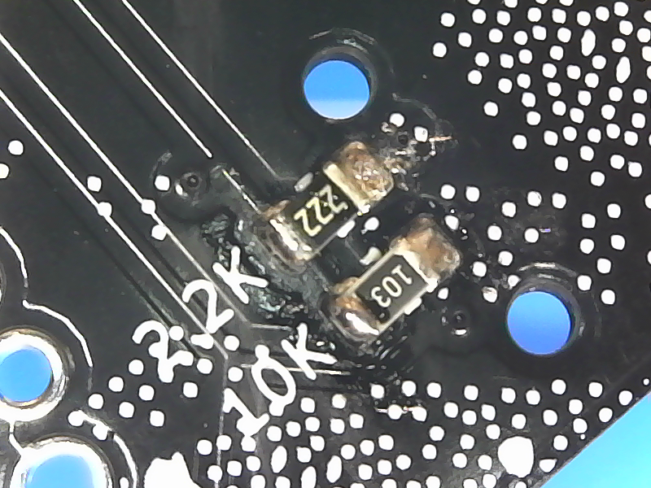

222 = 2.2K

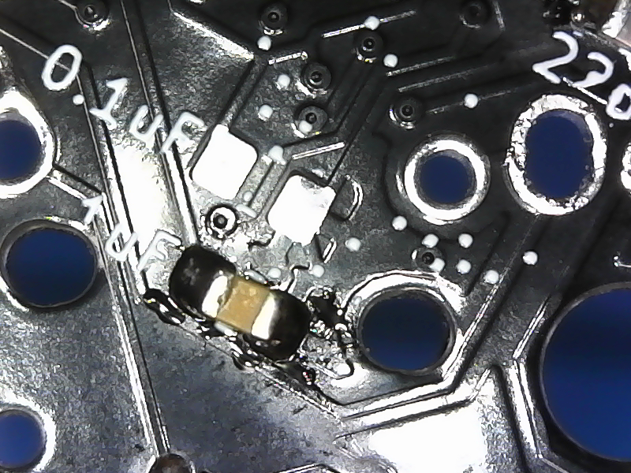

A Properly connected Cap

Notice the angle on the capacitor joint. It is solid.

Showing the orientation of the MCU. Notice that the oscilator has 2 connected pads

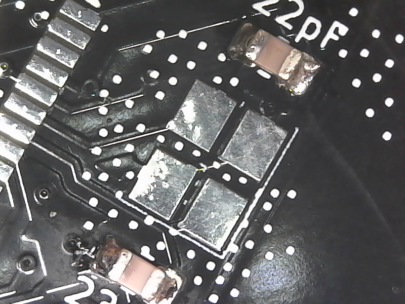

Close up of the osc traces, notice the connection

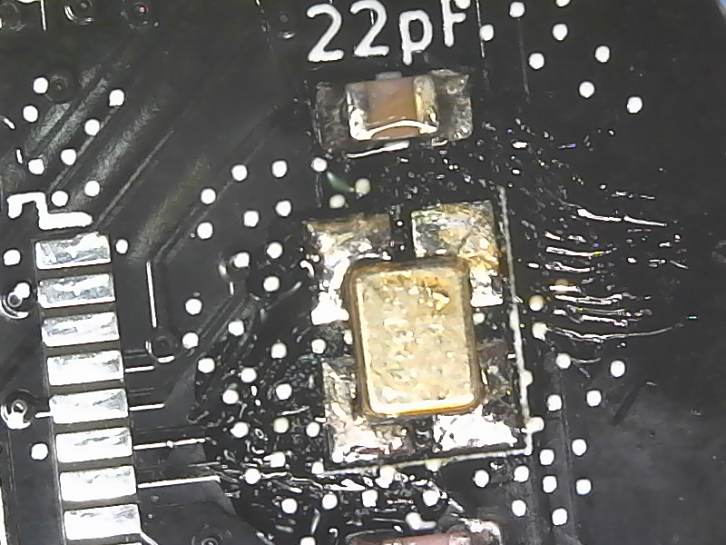

Oscilator whacked in properly

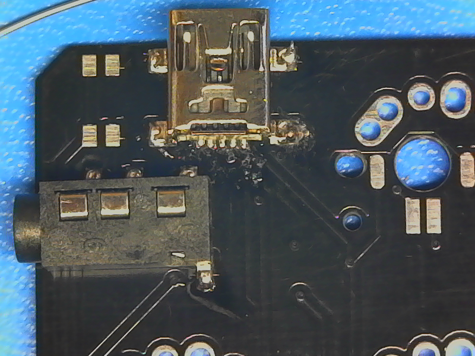

TRRS/USB solder, notice the amount on the TRRS, you want as much as possible on there!

Proper placement

Position of the circle on the silks for the IO

Flux gunk before and after cleaning with alcohol

A beautiful MCU job. Notice the spaces.

Trackball PCB so you don't need to squint

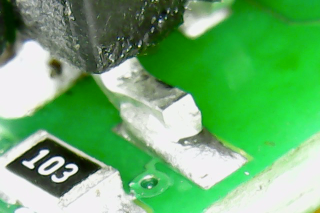

Properly soldered leg on Trackball PCB

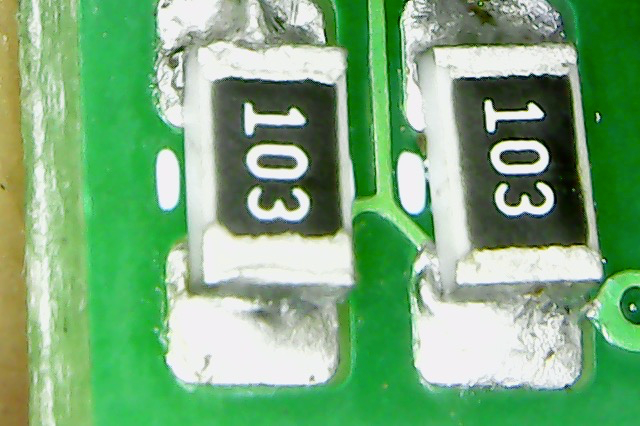

10K Resistors properly attached.

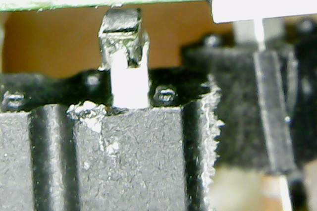

Leg not properly attached that came off PCB
 
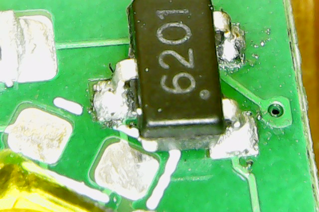

# There's a few more in the img/ take a look!
